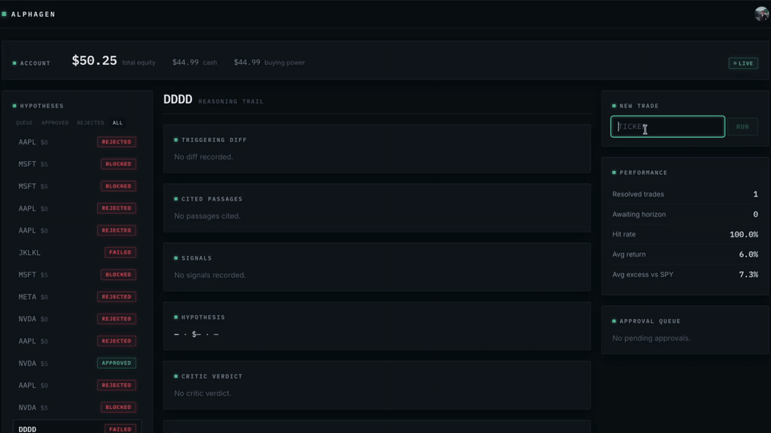

# AlphaGen

**An autonomous, human-in-the-loop equity research and trading platform.** AlphaGen ingests SEC filings, detects what *changed* between filings, grounds LLM-generated trade hypotheses in cited evidence, enforces deterministic risk guardrails, and (only after explicit human approval) executes live orders through Robinhood.



---

## What it does

Submitting a ticker kicks off a multi-agent pipeline that runs end-to-end in the background:

1. **Ingest** — pulls the company's 10-K/10-Q filings from SEC EDGAR, sections them, chunks them, and embeds them into Postgres/pgvector.
2. **Research** — builds an evidence bundle with hybrid retrieval, annotates it with a filing-over-filing **diff** (what did management change in the risk factors since last year?), and attaches structured market signals from Financial Modeling Prep.
3. **Hypothesize** — an LLM analyst proposes at most one long trade (or abstains), constrained to strict JSON with citations back to specific filing passages.
4. **Critique** — an adversarial critic reviews the thesis. Its verdict is advisory: it's recorded and surfaced at the approval gate, but the human makes the call.
5. **Guardrails** — deterministic hard/soft rules validate the hypothesis, including a **citation-resolution check**: every cited `(accession, section)` must exist in the retrieved evidence, which eliminates hallucinated sources.
6. **Human gate** — the graph pauses *before* execution (`interrupt_before=["execute"]`) and gets saved in Postgres. The owner reviews the full reasoning trail in the UI and approves or rejects.
7. **Execute & reconcile** — approved trades are placed via Robinhood's Trading MCP server; a background scheduler reconciles fills and measures realized performance against an SPY benchmark.

Every run — approved, rejected, or failed — lands in a terminal, auditable state with its complete reasoning trail: the triggering diff, the cited passages, the critic's verdict, and each guardrail result.

## Architecture


The graph is compiled **once per process** against LangGraph's `AsyncPostgresSaver`, so a paused run is not held in memory — its checkpoint lives in Postgres, and approval can resume the thread hours later, even across server restarts.

### Retrieval pipeline

Retrieval is a three-stage hybrid ranker, evaluated against a golden dataset:

```
dense (pgvector cosine, 384-dim MiniLM)  ─┐
                                          ├─► Reciprocal Rank Fusion ─► cross-encoder rerank ─► top-k
sparse (BM25 over the filing corpus)     ─┘         (ms-marco-MiniLM-L-6-v2)
```

On top of retrieval sits a **semantic diff engine** (embedding cosine over sentence pairs) that flags which retrieved passages are *new or materially changed* versus the prior filing. This surfaces exactly the signal a human analyst would look for and filters cosmetic edits.

## Measured metrics against Golden Set

Retrieval quality and safety behavior are asserted in CI on every push — the numbers below are from the pipeline, not estimates:

| What | Result | How it's enforced |
|---|---|---|
| Retrieval precision@5 | **0.72** (mean, dense stage) | per-query floor of 0.40 fails the build — a ratchet, raised as retrieval improves |
| Retrieval recall | **1.00** (mean, dense stage) | CI floor of 0.50 |
| Golden dataset | 15 labeled queries over real 10-K sections | versioned in-repo; gates every merge |

One live trade has completed the full lifecycle, proposed, cited, critiqued, approved, executed, reconciled, resulting in a **positive** return. 

## Engineering highlights

- **Durable human-in-the-loop orchestration** — LangGraph with Postgres checkpointing; the approval gate is a graph interrupt, not an application-level hack. One-active-run-per-ticker is enforced at the API (`409` with the blocking `decision_id` so the UI can deep-link to the existing trail).
- **Run lifecycle that can't leak** — background runs are `asyncio` tasks with hard references (guarding against mid-flight garbage collection) and a catch-all failure path: every run terminates in a DB-visible `pending` / `rejected` / `failed` state with a recorded reason. No zombie runs.
- **Defense-in-depth against hallucination** — JSON-schema-constrained LLM output, an advisory critic pass, and *deterministic* guardrails with a hard citations rule that verifies every source against the actual evidence bundle.
- **Layered risk controls** — a ticker allowlist, per-trade and total-exposure notional caps, a daily trade rate limit, and a daily-loss kill-switch that halts all trading, all enforced as hard rules independent of any model output.
- **Multi-tenant isolation** — every query scopes explicitly by `user_id` through the repo layer, so tenant filtering lives in one place. Clerk handles authentication end-to-end (JWT-verified API, React SDK on the frontend).
- **Real brokerage integration** — Robinhood's Trading MCP server via `langchain-mcp-adapters`, with full OAuth token lifecycle management and Fernet-encrypted token storage at rest.
- **Continuous evaluation** — a golden-dataset RAG eval harness and A/B embedding comparisons keep retrieval quality measurable (see the metrics table above) with guardrails and API behavior are covered by pytest.

## Tech stack

| Layer | Technology |
|---|---|
| Orchestration | LangGraph (durable Postgres checkpointing), LangChain MCP adapters |
| API | FastAPI (async), Uvicorn, APScheduler |
| LLM | Google Gemini |
| Retrieval | pgvector, sentence-transformers, rank-bm25, cross-encoder reranking |
| Data | PostgreSQL 16 + pgvector, SQLAlchemy 2.0, Alembic migrations |
| Ingestion | SEC EDGAR (HTML parsing), Financial Modeling Prep |
| Execution | Robinhood Trading MCP, OAuth 2.0, Fernet-encrypted tokens |
| Frontend | React 19, TypeScript, Vite, Tailwind CSS 4, TanStack Query, Clerk |
| Tooling | uv, Ruff, pytest, Docker Compose |

## Getting started

Requires uv, Docker, and Node 20+.

```bash
# 1. Configure environment (API keys, Clerk, database URL)
cp .env.example .env   # then fill in values

# 2. Start Postgres (the init migration creates the pgvector extension)
docker compose up -d db

# 3. Apply database migrations, then start the API
uv run alembic upgrade head
docker compose up -d --build api

# 4. Start the frontend
cd web && npm install && npm run dev
```

The API serves at `http://localhost:8000`, the dashboard at the Vite dev URL it prints.

```bash
# Run the test suite and linter
uv run pytest
uv run ruff check .
```

## Project structure

```
app/
├── agents/        # LangGraph graph, nodes, and typed state
├── api/           # FastAPI app, background run lifecycle
├── rag/           # chunking, embeddings, hybrid retrieval, semantic diff
├── ingestion/     # SEC EDGAR + Financial Modeling Prep pipelines
├── guardrails/    # deterministic hard/soft trade validation rules
├── execution/     # Robinhood MCP broker, order DAL, fill reconciliation
├── eval/          # golden-dataset RAG evals, embedding A/B tests
├── security.py    # OAuth token storage (Fernet-encrypted)
└── db.py          # engine + commit-on-exit session helper
web/               # React 19 + TypeScript dashboard
alembic/           # schema migrations
```

## Limitations

Things this project deliberately doesn't do, and gaps I know about:

- **It is not trying to generate alpha.** Long-only, one hypothesis per run, a small ticker allowlist, and $5-per-trade caps. The interesting problem here is the *system* (grounded reasoning, safety rails, durable orchestration around real money) not the strategy. The `n = 1` live-trade stat above is proof of plumbing, not performance.
- **The golden dataset is 15 queries**, and the CI metrics score the dense retrieval stage (the full hybrid + rerank path runs in production but isn't what the floors measure). Big enough to catch regressions and it is not a proper benchmark.
- **Retrieval evals measure retrieval, not end-to-end thesis quality.** Citation resolution guarantees hypotheses cite *real* passages; whether a thesis is *good* is still judged by the critic and the human, not a metric.
- **Single-process assumptions.** Embedding and reranking models run in-process (lazy-loaded), and the reconciliation scheduler lives inside the API process. Fine at this scale; a real deployment would split them out.
- **One broker, one account.** Execution is built against Robinhood's Trading MCP server; the broker interface is thin enough to swap, but nothing else has been.

## Disclaimer

AlphaGen is a personal research project. It is not financial advice, and nothing here is an invitation to trade real money with it.
