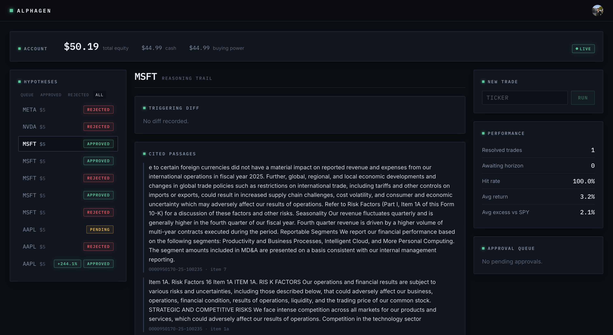
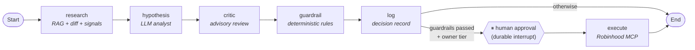

# AlphaGen

**An autonomous, human-in-the-loop equity research and trading platform.** AlphaGen ingests SEC filings, detects what *changed* between filings, grounds LLM-generated trade hypotheses in cited evidence, enforces deterministic risk guardrails, and — only after explicit human approval — executes live orders through Robinhood.



---

## What it does

Submitting a ticker kicks off a multi-agent pipeline that runs end-to-end in the background:

1. **Ingest** — pulls the company's 10-K/10-Q filings from SEC EDGAR, sections them, chunks them, and embeds them into Postgres/pgvector.
2. **Research** — builds an evidence bundle with hybrid retrieval, annotates it with a filing-over-filing **diff** (what did management change in the risk factors since last quarter?), and attaches structured market signals from Financial Modeling Prep.
3. **Hypothesize** — an LLM analyst proposes at most one long trade (or abstains), constrained to strict JSON with citations back to specific filing passages.
4. **Critique** — an adversarial critic reviews the thesis. Its verdict is advisory: it's recorded and surfaced at the approval gate, but the human makes the call.
5. **Guardrails** — deterministic hard/soft rules validate the hypothesis, including a **citation-resolution check**: every cited `(accession, section)` must exist in the retrieved evidence, which mechanically eliminates hallucinated sources.
6. **Human gate** — the graph pauses *before* execution (`interrupt_before=["execute"]`) and parks durably in Postgres. The owner reviews the full reasoning trail in the UI and approves or rejects.
7. **Execute & reconcile** — approved trades are placed via Robinhood's Trading MCP server; a background scheduler reconciles fills and measures realized performance against an SPY benchmark.

Every run — approved, rejected, or failed — lands in a terminal, auditable state with its complete reasoning trail: the triggering diff, the cited passages, the critic's verdict, and each guardrail result.

## Architecture



The graph is compiled **once per process** against LangGraph's `AsyncPostgresSaver`, so a run paused at the approval gate survives requests, worker restarts, and multiple Gunicorn workers — approval can resume a thread hours later from its checkpoint.

### Retrieval pipeline

Retrieval is a three-stage hybrid ranker, evaluated against a golden dataset:

```
dense (pgvector cosine, 384-dim MiniLM)  ─┐
                                          ├─► Reciprocal Rank Fusion ─► cross-encoder rerank ─► top-k
sparse (BM25 over the filing corpus)     ─┘         (ms-marco-MiniLM-L-6-v2)
```

On top of retrieval sits a **semantic diff engine** (difflib + RapidFuzz + embedding cosine over sentence pairs) that flags which retrieved passages are *new or materially changed* versus the prior filing — surfacing exactly the signal a human analyst would look for, and filtering cosmetic edits.

## Measured, not vibes

Retrieval quality and safety behavior are asserted in CI on every push — the numbers below are from the pipeline, not estimates:

| What | Result | How it's enforced |
|---|---|---|
| Retrieval precision@5 | **0.72** (mean, dense stage) | per-query floor of 0.40 fails the build — a ratchet, raised as retrieval improves |
| Retrieval recall | **1.00** (mean, dense stage) | CI floor of 0.50 |
| Golden dataset | 15 labeled queries over real 10-K sections | versioned in-repo; gates every merge |
| Hallucinated citations reaching execution | **0 by construction** | hard guardrail: every cited `(accession, section)` must resolve against the retrieved evidence bundle |
| Unsafe-trade guardrails | 16 deterministic tests | caps, allowlist, rate limit, kill-switch, market hours, live-price sanity |
| Test suite | **64 tests** green | lint + full suite on every push |

One live trade has completed the full lifecycle — proposed, cited, critiqued, approved, executed, reconciled: **+3.2% return, +2.1% excess vs SPY**. That's `n = 1`: a systems result demonstrating the pipeline works end-to-end with real money, not a claim of alpha.

## Engineering highlights

- **Durable human-in-the-loop orchestration** — LangGraph with Postgres checkpointing; the approval gate is a first-class graph interrupt, not an application-level hack. One-active-run-per-ticker is enforced at the API (`409` with the blocking `decision_id` so the UI can deep-link to the existing trail).
- **Run lifecycle that can't leak** — background runs are `asyncio` tasks with hard references (guarding against mid-flight garbage collection) and a catch-all failure path: every run terminates in a DB-visible `pending` / `rejected` / `failed` state with a recorded reason. No zombie runs.
- **Defense-in-depth against hallucination** — JSON-schema-constrained LLM output, an advisory critic pass, and *deterministic* guardrails with a hard citations rule that verifies every source against the actual evidence bundle.
- **Layered risk controls** — a ticker allowlist, per-trade and total-exposure notional caps, a daily trade rate limit, and a daily-loss kill-switch that halts all trading, all enforced as hard rules independent of any model output.
- **Multi-tenant isolation, two layers deep** — every session sets the tenant key as a GUC and every query scopes explicitly by `user_id`; beneath that, Postgres **row-level security** policies are fail-closed (a missing tenant key matches zero rows). Clerk handles authentication end-to-end (JWT-verified API, React SDK on the frontend). See Limitations for an honest note on the current RLS enforcement gap.
- **Real brokerage integration** — Robinhood's Trading MCP server via `langchain-mcp-adapters`, with full OAuth token lifecycle management and Fernet-encrypted token storage at rest.
- **Continuous evaluation** — a golden-dataset RAG eval harness and A/B embedding comparisons keep retrieval quality measurable rather than vibes-based (see the metrics table above); guardrails and API behavior are covered by pytest.

## Design decisions

- **LLMs reason, code decides.** Nothing that moves money depends on model output being correct. The model can only *propose* a hypothesis; deterministic guardrails, order mapping, and idempotency keys own execution. A smarter prompt can improve trade quality but can never widen the blast radius.
- **Human approval is a graph interrupt, not a status flag.** The obvious design — write `status = "pending"` and poll — makes resumption an application-level problem (which worker owns it? what state was in memory?). Making the gate a LangGraph `interrupt_before` against a Postgres checkpointer means a paused run is a first-class, durable object: approval hours later resumes the exact thread, on any worker, after any restart.
- **Hallucination is handled mechanically, not with prompting.** Instead of asking the model nicely to cite real sources, the guardrail resolves every citation against the evidence bundle actually retrieved for that run. An unresolvable citation is a hard block. The failure mode "confident thesis built on an invented quote" cannot reach the approval gate.
- **Hybrid retrieval, staged by cost.** Dense embeddings buy semantic recall; BM25 buys exact/rare-token recall (accession numbers, accounting line items) that embeddings blur. The two candidate lists are fused with RRF — which compares *ranks*, sidestepping the fact that cosine distances and BM25 scores live on incomparable scales — and only the fused top gets the expensive cross-encoder. The golden-dataset floors in CI exist so a future "improvement" can't silently regress retrieval.
- **The critic is advisory by design.** An adversarial LLM reviewing another LLM is useful signal but it's still model output — so its verdict is recorded and shown to the human at the gate rather than given veto power. The only actors that can kill a trade are deterministic rules and the human.

## Tech stack

| Layer | Technology |
|---|---|
| Orchestration | LangGraph (durable Postgres checkpointing), LangChain MCP adapters |
| API | FastAPI (async), Uvicorn, APScheduler |
| LLM | Google Gemini (JSON mode) |
| Retrieval | pgvector, sentence-transformers, rank-bm25, cross-encoder reranking |
| Data | PostgreSQL 16 + pgvector, SQLAlchemy 2.0, Alembic migrations |
| Ingestion | SEC EDGAR (selectolax HTML parsing), Financial Modeling Prep |
| Execution | Robinhood Trading MCP, OAuth 2.0, Fernet-encrypted tokens |
| Frontend | React 19, TypeScript, Vite, Tailwind CSS 4, TanStack Query, Clerk |
| Tooling | uv, Ruff, pytest, Docker Compose |

## Getting started

Requires Docker, [uv](https://docs.astral.sh/uv/), and Node 20+.

```bash
# 1. Configure environment (API keys, Clerk, database URL)
cp .env.example .env   # then fill in values

# 2. Start Postgres (pgvector) + API
docker compose up --build

# 3. Apply database migrations
uv run alembic upgrade head

# 4. Start the frontend
cd web && npm install && npm run dev
```

The API serves at `http://localhost:8000`, the dashboard at the Vite dev URL it prints.

```bash
# Run the test suite and linter
uv run pytest
uv run ruff check .
```

## Project structure

```
app/
├── agents/        # LangGraph graph, nodes, and typed state
├── api/           # FastAPI app, background run lifecycle
├── rag/           # chunking, embeddings, hybrid retrieval, semantic diff
├── ingestion/     # SEC EDGAR + Financial Modeling Prep pipelines
├── guardrails/    # deterministic hard/soft trade validation rules
├── execution/     # Robinhood MCP broker, order DAL, fill reconciliation
├── eval/          # golden-dataset RAG evals, embedding A/B tests
├── security.py    # OAuth token storage (Fernet-encrypted)
└── db.py          # RLS-scoped sessions (fail-closed tenancy)
web/               # React 19 + TypeScript dashboard
alembic/           # schema migrations
```

## Limitations

Things this project deliberately doesn't do, and gaps I know about:

- **It is not trying to generate alpha.** Long-only, one hypothesis per run, a small ticker allowlist, and $5-per-trade caps. The interesting problem here is the *system* — grounded reasoning, safety rails, durable orchestration around real money — not the strategy. The `n = 1` live-trade stat above is proof of plumbing, not performance.
- **RLS is defense-in-depth, not yet the enforcement layer.** The Postgres policies are written fail-closed, but the app currently connects as a superuser role, which bypasses RLS — so tenant isolation is actually enforced by the session-scoped GUC and explicit `user_id` predicates in the data-access layer. Moving the runtime to a `NOSUPERUSER` role so the policies bite is the next hardening step.
- **The golden dataset is 15 queries**, and the CI metrics score the dense retrieval stage (the full hybrid + rerank path runs in production but isn't what the floors measure). Big enough to catch regressions; not a benchmark, and growing it is ongoing.
- **Retrieval evals measure retrieval, not end-to-end thesis quality.** Citation resolution guarantees hypotheses cite *real* passages; whether a thesis is *good* is still judged by the critic and the human, not a metric.
- **Single-process assumptions.** Embedding and reranking models run in-process (lazy-loaded), and the reconciliation scheduler lives inside the API process. Fine at this scale; a real deployment would split them out.
- **One broker, one account.** Execution is built against Robinhood's Trading MCP server; the broker interface is thin enough to swap, but nothing else has been.

## Disclaimer

AlphaGen is a personal research project. It is not financial advice, and nothing here is an invitation to trade real money with it.
